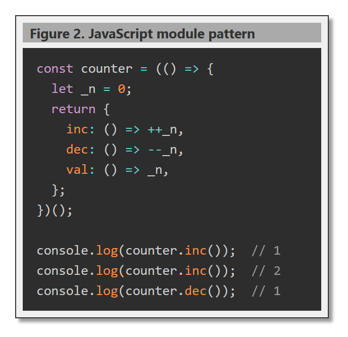

# ViewCodeComponent

A W3C custom element (`<view-code>`) that displays a titled, bordered code panel. Users click the panel body to widen it and click the title bar to narrow it, one step per click.

## Files

```
ViewCodeComponent/
  js/ViewCode.js           component definition
  css/ViewCode.css         host-page placement helpers
  ViewCodeComponent.html   demo / test page
  SpecViewCodeComponent.md design specification
```

## Setup

Load the component script (and optionally Prism for syntax highlighting):

```html
<link rel="stylesheet" href="../css/prism.css">
<link rel="stylesheet" href="css/ViewCode.css">
<script src="../js/prism.js" defer></script>
<script src="js/ViewCode.js" defer></script>
```

The containing page must define `--light` and `--dark` CSS custom properties for the default color scheme:

```css
:root {
  --light: #f0f0f0;
  --dark:  #333;
}
```

## Usage



### Plain text

Wrap content in a `<template slot="code">` to display it as literal text:

```html
<view-code width="35rem" trim normalize-indent style="float:right;">
  Figure 1. HTML fragment
  <template slot="code">
    <div class="example">
      <p>Hello</p>
    </div>
  </template>
</view-code>
```

### Prism syntax highlighting

Supply a `<pre><code class="language-...">` in the `slot="code"`:

```html
<view-code highlight="prism" language="javascript" width="50rem" trim normalize-indent>
  Figure 2. Counter module
  <pre slot="code"><code class="language-javascript">
    const counter = (() => {
      let _n = 0;
      return { inc: () => ++_n, val: () => _n };
    })();
  </code></pre>
</view-code>
```

## Attributes

| Attribute          | Default         | Description                                              |
|--------------------|-----------------|----------------------------------------------------------|
| `width`            | `max-content`   | Initial width of the view (any CSS length)               |
| `height`           | `auto`          | Height of the code panel; enables vertical scroll        |
| `overflow-x`       | `auto`          | Horizontal overflow: `auto`, `scroll`, or `hidden`       |
| `bg-color`         | `var(--light)`  | Background of the view box                               |
| `title-bg-color`   | `#aaa`          | Background of the title bar                              |
| `background-color` | `var(--light)`  | Background of the code panel                             |
| `color`            | `var(--dark)`   | Text color of the code panel                             |
| `font-family`      | (inherit)       | Font family for the code panel                           |
| `font-size`        | (inherit)       | Font size for the code panel                             |
| `code-padding`     | `0.75rem 1rem`  | Padding inside the code panel                            |
| `highlight`        | (none)          | Set to `prism` to enable Prism.js syntax highlighting    |
| `language`         | (none)          | Prism language, e.g. `javascript`, `cpp`, `css`          |
| `trim`             | false           | Strip leading/trailing blank lines from content          |
| `normalize-indent` | false           | Remove common leading whitespace from all lines          |
| `step-px`          | `40`            | Pixels added or removed per width click                  |
| `min-width`        | `240`           | Minimum width in pixels when narrowing                   |

## Interaction

- **Click code panel** — widens by `step-px` pixels.
- **Click title bar** — narrows by `step-px` pixels, down to `min-width`.

Width is tracked on the outer view box. The inner `<pre>` always fills it at `width: 100%`, so the panel tracks correctly even when content overflows.

## Inline Style Notes

- `font-size` is an inherited property and cascades through the shadow DOM boundary, so `style="font-size: 0.9rem"` on the element works.
- `height` does not inherit. Use the `height` attribute — do not set it via inline style.
- `--title-font-size` is a CSS custom property that controls the title bar font size (default `1rem`). Set it on the element or in page CSS: `style="--title-font-size: 1.2rem"`.
