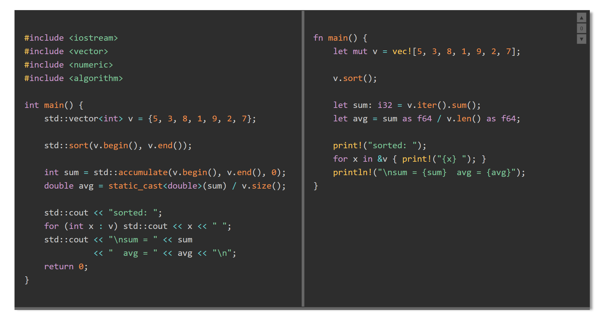

# ViewComparatorComponent

A W3C custom element (`<view-comparator>`) that displays two side-by-side panels separated by a draggable splitter bar. Designed for comparing code or text across languages, versions, or styles.

## Files

```
ViewComparatorComponent/
  js/
    ViewComparator.js           component definition
  css/
    ViewComparator.css          host-page placement helpers
  ViewComparatorComponent.html  demo / test page
  SpecComparatorComponent.md    detailed specification
  README.md                     this file
```

## Usage



```html
<link rel="stylesheet" href="css/ViewComparator.css">
<script src="js/ViewComparator.js" defer></script>

<view-comparator width="60rem" height="20rem" left-ratio="0.5">
  <pre slot="left">Left panel content.</pre>
  <pre slot="right">Right panel content.</pre>
</view-comparator>
```

With Prism syntax highlighting:

```html
<link rel="stylesheet" href="../css/prism.css">
<script src="../js/prism.js" defer></script>
<script src="js/ViewComparator.js" defer></script>

<view-comparator width="70rem" height="24rem" highlight="prism" left-ratio="0.5">
  <pre slot="left"><code class="language-cpp">// C++ code</code></pre>
  <pre slot="right"><code class="language-rust">// Rust code</code></pre>
</view-comparator>
```

## Attributes

| Attribute        | Default        | Description                                          |
|------------------|----------------|------------------------------------------------------|
| `width`          | auto           | Total component width (any CSS length)               |
| `height`         | auto           | Panel height                                         |
| `left-ratio`     | 0.5            | Initial fraction of width given to the left panel    |
| `bar-width`      | 6px            | Width of the splitter bar                            |
| `bar-color`      | #888           | Color of the splitter bar                            |
| `bg-color`       | var(--light)   | Background of both panels                            |
| `color`          | var(--dark)    | Foreground (text) color of both panels               |
| `overflow-x`     | auto           | Horizontal overflow: `auto`, `scroll`, or `hidden`   |
| `code-padding`   | 0.75rem 1rem   | Padding inside each panel                            |
| `highlight`      | (none)         | Set to `prism` to enable Prism.js highlighting       |
| `step-px`        | 40             | Pixels transferred per panel-click width adjustment  |
| `min-panel-px`   | 120            | Minimum width in pixels for either panel             |
| `min-height-px`  | 80             | Minimum height in pixels                             |
| `offset-step-px` | 40             | Pixels shifted per right-panel offset action         |

## Interactions

### Panel width

- **Drag the splitter bar** left or right to redistribute width between panels.
- **Click the left panel** to grow it by `step-px`; click the right panel to grow it.

### Component height

- **Drag the resizer strip** at the bottom edge to change the component height.

### Right-panel vertical offset

When comparing content of unequal length, the right panel's content can be shifted down to align specific lines with the left panel. Space added above the content inherits the content's own background color.

| Action | Effect |
|--------|--------|
| Click **▼** button | Shift right content down by `offset-step-px` |
| Click **▲** button | Shift right content up by `offset-step-px` |
| Click **0** button | Reset offset to zero |
| **Alt+↓** (right panel focused) | Same as ▼ |
| **Alt+↑** (right panel focused) | Same as ▲ |
| **Escape** (right panel focused) | Same as 0 |

The ▲ 0 ▼ buttons appear near the top-right corner of the right panel. They are faint until hovered or until the right panel has focus (click anywhere in it).

## Dependencies

- **Prism.js** — optional; required only when `highlight="prism"` is set.
  Load `prism.js` and `prism.css` before the component script.
- No other runtime dependencies.
